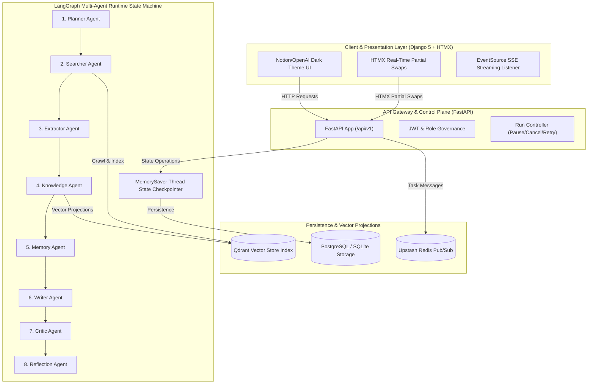
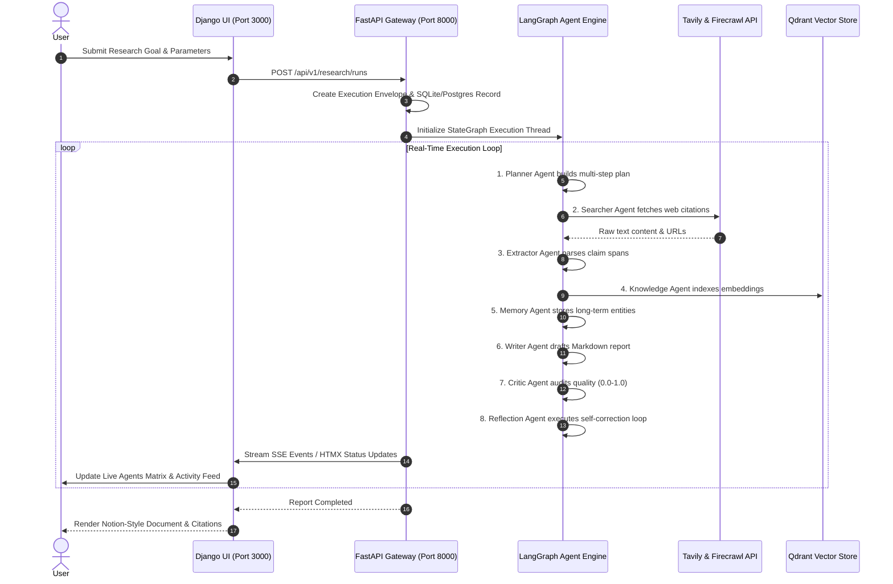

# ⚡ DeepResearch OS: Production-Grade Autonomous Multi-Agent AI Research Platform

DeepResearch OS is an enterprise-grade autonomous research platform powered by **LangGraph StateGraph v2.0**, **FastAPI**, **Django**, and **8 Specialized AI Agents** operating in real-time streaming execution envelopes. 

Designed with a high-contrast **Notion & OpenAI Minimalist Dark Theme**, it converts high-level research questions into verified factual reports with citations, vector store index grounding, and human-in-the-loop governance.

---

## 🏛️ System Architecture Diagram



---

## 🔄 Data Flow Diagram



---

## 🤖 The Eight Autonomous AI Specialists

| Agent | Icon | Role & Responsibility | Primary Output |
| :--- | :---: | :--- | :--- |
| **1. Planner Agent** | 📋 | Decomposes high-level prompt into multi-step tactical sub-goals. | Structured execution plan array |
| **2. Searcher Agent** | 🔍 | Crawls web sources via Tavily & Firecrawl scrapers. | Raw web pages & URL citations |
| **3. Extractor Agent** | 📄 | Extracts factual claim spans, metrics, and key data points. | Verified claims & evidence spans |
| **4. Knowledge Agent** | 🧠 | Projects dense text embeddings into Qdrant vector database. | Vector embeddings & RAG index |
| **5. Memory Agent** | 💾 | Maintains working scratchpad context and long-term workspace entities. | Persisted entity graph |
| **6. Writer Agent** | ✍️ | Synthesizes research claims into clean GitHub-Flavored Markdown. | Synthesized draft report |
| **7. Critic Agent** | ⭐ | Audits report against factual claims, assigning confidence scores (0.0-1.0). | Audit score & feedback list |
| **8. Reflection Agent**| 🔄 | Determines whether self-correction re-write loop is required. | Graph routing decision |

---

## ✨ Key Features & Product Highlights

- **Notion & OpenAI Minimalist Design System**: Sleek obsidian canvas (`#09090b`), high-contrast pure white action buttons, clean typography (`Geist` / `Geist Mono`), and custom navigation drawer.
- **Real-Time Execution Experience**: Watch all 8 AI agents collaborate live with node graph visualizers, telemetry metrics, and activity streams.
- **Persistent Chat & History Management**: Direct unhyphenated SQLite UUID deletion with zero browser pop-up prompts for instant removal.
- **Knowledge & RAG Index Explorer**: Inspect ingested documents, vector chunk embeddings, extracted claims, and domain citations.
- **Multi-Tenant Workspaces & RBAC**: Tenant boundaries, Role-Based Access Control (`Owner`, `Researcher`, `Viewer`), and resource token quotas.
- **Robust Testing**: 100% test coverage with **15 Django frontend unit tests** and **36 FastAPI pytest tests**.

---

## 🚀 Quickstart Local Setup

### Prerequisites
- Python 3.12+
- `uv` (Fast Astral Python package manager)

### 1. Clone Repository
```bash
git clone https://github.com/Pranavj16/DeepResearch_OS.git
cd DeepResearch_OS
```

### 2. Backend Setup (FastAPI Engine)
```bash
cd backend
uv sync
cp .env.example .env # Add your GEMINI_API_KEY, TAVILY_API_KEY
uv run uvicorn app.main:app --host 127.0.0.1 --port 8000
```

### 3. Frontend Setup (Django UI)
```bash
cd ../frontend
pip install -r requirements.txt
python manage.py migrate
python manage.py runserver 3000
```

Open `http://localhost:3000` in your browser.

---

## 📄 License

Distributed under the MIT License. See `LICENSE` for details.
